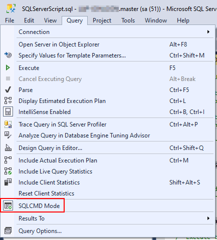

# Mobilize SnowConvert Training Labs Sample Files

This repository belongs to Mobilize.NET and its purpose is to provide with sample files and extra material for the SnowConvert training labs. It also provides a script to setup AdventureWorks in both a SQL Server locally and a Snowflake instance, which will be used to test these labs.

# Snowflake AdventureWorks Files and Scripts setups

## Prerequisites

The `AdventureWorksScriptSetup.ps1` contains all the code needed to configure the AdventureWorks database in both SQL Server and Snowflake. This script executes everything, but you need to satisfy some requirements first:

 - Downloaded this repository to your local computer.
 - Access to an SQL Server with Administrator access.
 - Snowsql utility is installed. You can download it [from here](https://docs.snowflake.com/en/user-guide/snowsql-install-config.html#id8). Be careful to select the latest, since they don't appear properly ordered.
 - Access to a Snowflake account with the possibility to create databases and schemas (if you don't have this permissions, you can follow these labs on a Trial Account).
 
## Usage

To successfully configure the SQL Server and Snowflake configurations, simply follow these steps:

1. Download this repository.
2. Open SQL Server Management and then open the `SQLServerScript.sql`.
3. Go to `Query > Select SQLCMD Mode`

4. Modify line 13 to point it to the full path to the `adventureworks_files` folder. Make sure it has a `\` at the end.
5. Execute the script. This will restore the required database to your SQL Server instance. Afterwards, you can query the tables and make sure there is data available. If there is no data available, drop the database and run the script again, but make sure to complete step 4.
6. Identify your Snowflake account locator. This should be located in the URL you use to login and will be required during the script's execution: 

7. Execute the script `AdventureWorksSetupSript.ps1` from PowerShell running as Administrator. This script will install specific objects required on SQL Server and Snowflake.
8. Follow the instructions on the script and supply every detail requested during the installation. The script will request for the following:
	- SQL Server Host
	- SQL Server user and password
	- Snowflake Account (from step 6)
	- Snowflake User
	- Snowflake Role
	- Snowflake Password
 
## Troubleshooting

### Not able to create databases in Snowflake

If you're not able to create databases in your Snowflake account, you could create a trial account and use that account for the test.

### Problems with Snowflake script login

If you're encountering errors logging in to Snowflake using the script you could also run the `AdventureWorksLabsObjectsSnowflake.sql` manually on Snowflake Console. Just make sure that to remove the `PUT` operations from the script and upload the data manually after creating the database and tables, by following these steps:

1. Go to `Databases > AdventureWorks > Tables`.
2. Choose the table you want to upload.
3. Click on Load Tables.
4. Select the Warehouse.
5. Look for the file for each table. The files are named the same as the tables so upload accordingly.
6. Choose the `ADVENTUREWORKS_CSV` format.
7. Click `Load` and wait for the data to upload.